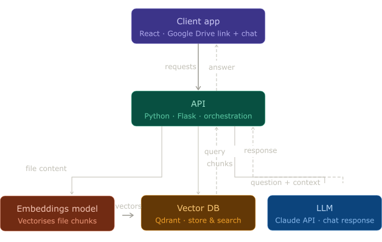

# Tenex Take-Home Assignment API

API for loading Google Drive documents into a vector store and chatting over them with RAG (retrieval-augmented generation).




## Prerequisites

- Docker
- Python 3.11+

## Getting started

1. Create a Python virtual environment at the repo root:

   ```bash
   python3 -m venv .venv
   source .venv/bin/activate   # or `\.venv\Scripts\activate` on Windows
   ```

2. Install dependencies:

   ```bash
   pip install -r requirements.txt
   ```

3. Copy `.env.example` to `.env`, and set your `LLM_API_KEY` (Claude API Key).

   ```bash
   cp .env.example .env
   ```

4. Run the server:

   ```bash
   python main.py
   ```

5. Run the text embeddings API (Ollama):

   ```bash
   docker build -t embeddings-api services/text-embeddings-api/
   docker run -p 11434:11434 embeddings-api
   ```

6. Run the vector DB (Qdrant):

   ```bash
   docker build -t vector-db services/vector-db/
   docker run -p 6333:6333 vector-db
   ```

## Project structure

- **`app.py`** – Application factory, dependency wiring, error handlers, rate limiting.
- **`config.py`** – Configuration from environment (rate limits, batch sizes, etc.).
- **`exceptions.py`** – Custom exceptions and consistent error response format.
- **`schemas.py`** – Pydantic request/response validation for the API.
- **`routes/`** – Blueprints: `drive` (load), `chat` (streaming RAG chat).
- **`services/`** – Business logic: `DriveService`, `ChatService` (injectable for tests).
- **`clients/`** – External clients: embeddings, vector DB, LLM.
- **`middleware/`** – Rate limiting (Flask-Limiter when installed).
- **`utils.py`** – Drive URL parsing, chunking, Google Drive fetch.

## Linting and tests

- **Lint** (Ruff):

  ```bash
  ruff check .
  ```

- **Tests** (pytest):

  ```bash
  pytest tests/ -v
  pytest tests/ --cov=. --cov-report=term-missing   # with coverage
  ```

## API

- **POST `/api/drive/load`** – Load a Google Drive folder or file. Body: `driveUrl`, `accessToken`, `googleId`. Rate limited.
- **POST `/api/agent/chat`** – Stream RAG chat. Body: `message`, `googleId`, optional `driveUrl`, optional `history`. Rate limited.

Errors return JSON `{ "error": "...", "details": ... }`. Validation errors return 400; rate limit returns 429.
